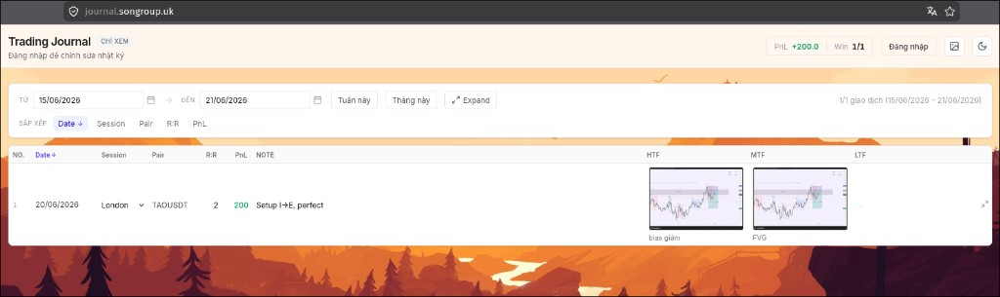

# Trading Journal

[English](README.en.md) · [Tiếng Việt](README.md)

Personal trading journal — log trades, upload chart images, filter/sort by date, and customize the UI.



## Tech stack

| Layer | Technology |
|-------|------------|
| Frontend | Vue 3, TypeScript, Vue Router, Tailwind CSS v4, Vite |
| Backend | Node.js, Express 5, SQLite (`node:sqlite`) |
| Images | Multer (upload), Sharp (WebP thumbnails) |
| Auth | Bearer token, credentials in `.env` |

## Features

### Trading journal
- Compact table: No., Date, Session, Pair, R:R, PnL, Note, HTF/MTF/LTF
- Inline edit with auto-save (500ms debounce)
- Paste / upload chart images (Ctrl+V), full-size view via lightbox
- ~320px WebP thumbnails in the table; full image loads on click
- Pair suggestions from the database
- Date range filter with **This week** / **This month** shortcuts
- Sort by: Date (`created_at`), Session, Pair, R:R, PnL
- Expand images globally or per row

### Authentication
- Not logged in: view-only (read-only)
- Logged in: add/edit/delete entries, upload images
- Token stored in `sessionStorage` (cleared when the tab closes)

### UI
- Dark / light mode (saved in `localStorage`)
- Custom page background: solid color, pattern, or uploaded image
- Background settings persisted on server + `localStorage` (image upload requires login)

## Project structure

```
journal/
├── frontend/          # Vue SPA (dev :5173)
├── backend/           # Express API + static files in production
│   ├── src/           # server, routes, db, auth
│   ├── data/          # journal.db (SQLite)
│   ├── uploads/       # chart images + background images
│   ├── dist/          # frontend build (production)
│   ├── ecosystem.config.cjs  # PM2 config
│   └── .env           # AUTH_USERNAME, AUTH_PASSWORD
├── scripts/
│   └── build.sh       # build frontend → backend/dist
├── docs/
│   └── screenshot.png # README screenshot
```

## Requirements

- **Node.js** `^22.18.0` or `>=24.12.0` (frontend)
- **npm**

## Installation

```bash
# Clone / enter the project directory
cd journal

# Install dependencies
cd frontend && npm install
cd ../backend && npm install
```

### Environment variables

Create `backend/.env` (see `backend/.env.example`):

```env
AUTH_USERNAME=admin
AUTH_PASSWORD=your-password
```

> `.env` is gitignored — do not commit credentials.

## Development

Open **two terminals**:

```bash
# Terminal 1 — API (:3001)
cd backend && npm run dev

# Terminal 2 — Frontend (:5173, proxies /api and /uploads)
cd frontend && npm run dev
```

Open: http://localhost:5173

## Production

### 1. Build frontend into backend

```bash
./scripts/build.sh
# or
cd backend && npm run build:frontend
```

The script runs `npm run build` in `frontend/` and copies the output to `backend/dist/`.

### 2. Start the server

```bash
cd backend && npm start
```

Open: http://localhost:3001 — the backend serves both the API and static HTML.

### 3. PM2 (optional)

```bash
# From the backend directory, after building the frontend
cd backend && pm2 start ecosystem.config.cjs
```

Default config: port `3001`, `NODE_ENV=production`.

## API

| Method | Endpoint | Auth | Description |
|--------|----------|------|-------------|
| `GET` | `/api/entries` | — | List entries |
| `GET` | `/api/pairs` | — | List pairs in use |
| `POST` | `/api/entries` | ✓ | Create entry |
| `PATCH` | `/api/entries/:id` | ✓ | Update entry |
| `DELETE` | `/api/entries/:id` | ✓ | Delete entry |
| `POST` | `/api/entries/:id/images/:slot` | ✓ | Upload image (`htf`/`mtf`/`ltf`) |
| `DELETE` | `/api/entries/:id/images/:slot` | ✓ | Remove image |
| `POST` | `/api/auth/login` | — | Log in |
| `POST` | `/api/auth/logout` | ✓ | Log out |
| `GET` | `/api/auth/me` | ✓ | Check session |
| `GET` | `/api/settings/background` | — | Read background settings |
| `PUT` | `/api/settings/background` | ✓ | Update background |
| `POST` | `/api/settings/background/image` | ✓ | Upload background image |

Static images: `/uploads/<filename>`

## Data

| Data | Location |
|------|----------|
| SQLite DB | `backend/data/journal.db` |
| Chart / background images | `backend/uploads/` |
| Theme, background (cache) | `localStorage` (browser) |
| Background settings (server) | `settings` table in SQLite |
| Auth token | `sessionStorage` (browser) |

Backup: copy `backend/data/journal.db` and the `backend/uploads/` folder.

## Useful scripts

```bash
# Frontend
cd frontend
npm run dev          # dev server
npm run build        # production build
npm run type-check   # TypeScript check
npm run lint         # eslint + oxlint

# Backend
cd backend
npm run dev          # API + hot reload (--watch)
npm start            # production
npm run build:frontend
```

## Notes

- SQLite uses the built-in `node:sqlite` (Node 22+); no `better-sqlite3` required.
- Chart uploads automatically generate `*-thumb.webp` thumbnails via Sharp.
- `backend/dist/` and `backend/data/*.db` are not committed (see `.gitignore`).
