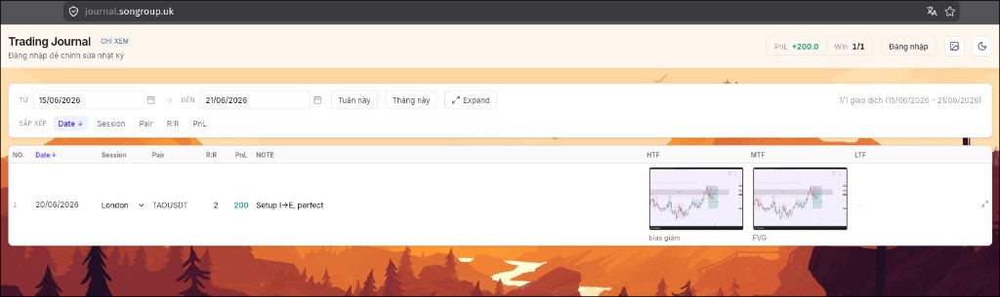

# Trading Journal

[Tiếng Việt](README.md) · [English](README.en.md)

Ứng dụng nhật ký giao dịch đa tài khoản — mỗi account một database riêng, quản lý bởi root từ `.env`.



## Tech stack

| Phần | Công nghệ |
|------|-----------|
| Frontend | Vue 3, TypeScript, Vue Router, Tailwind CSS v4, Vite |
| Backend | Node.js, Express 5, SQLite (`node:sqlite`) |
| Ảnh | Multer (upload), Sharp (thumbnail WebP) |
| Auth | Bearer token; root trong `.env`, user accounts trong `accounts.db` |

## Tính năng

### Đa tài khoản
- **Root** (`AUTH_USERNAME` / `AUTH_PASSWORD` trong `.env`): trang `/admin` tạo/sửa/xóa/vô hiệu account
- Mỗi **account** có SQLite + uploads riêng (`data/users/<slug>/`, `uploads/users/<slug>/`)
- Journal public tại `/u/:slug` (guest chỉ xem entry `visible`)
- Đăng nhập account → chỉnh journal của mình

### Nhật ký giao dịch
- Bảng: Date, Pair, R:R, PnL, Tags, Images
- Tags (IN HOA): autocomplete, kéo thả, style đặc biệt (TP/SL/BE, session, bias…)
- Inline edit, auto-save (debounce 500ms)
- Paste / upload ảnh chart (Ctrl+V), lightbox
- Lọc theo khoảng ngày, sort Date / Pair / R:R / PnL / Kết quả

### Xác thực
- Guest: chỉ xem journal công khai
- User: sửa journal của mình
- Root: quản lý accounts (+ có thể sửa mọi journal)

### Giao diện
- Dark / light mode
- Nền trang theo từng journal (solid / pattern / ảnh)

## Cấu trúc thư mục

```
journal/
├── frontend/          # Vue SPA (dev :5173)
├── backend/           # Express API + serve static production
│   ├── src/           # server, routes, db, accounts, auth
│   ├── data/
│   │   ├── accounts.db           # registry accounts
│   │   └── users/<slug>/journal.db
│   ├── uploads/users/<slug>/     # ảnh theo account
│   ├── dist/          # frontend build (production)
│   ├── ecosystem.config.cjs
│   └── .env           # AUTH_USERNAME, AUTH_PASSWORD (root)
├── scripts/
│   └── build.sh
├── docs/
│   └── screenshot.png
```

## Yêu cầu

- **Node.js** `^22.18.0` hoặc `>=24.12.0` (frontend)
- **npm**

## Cài đặt

```bash
# Clone / vào thư mục project
cd journal

# Cài dependencies
cd frontend && npm install
cd ../backend && npm install
```

### Biến môi trường

Tạo file `backend/.env` (tham khảo `backend/.env.example`):

```env
AUTH_USERNAME=admin
AUTH_PASSWORD=your-password

# Chỉ dùng khi migrate journal.db cũ lần đầu (mặc định main/main)
# MIGRATE_ACCOUNT_USERNAME=main
# MIGRATE_ACCOUNT_PASSWORD=main
```

> File `.env` đã được gitignore — không commit credentials.
>
> Journal cũ `data/journal.db` sẽ tự chuyển sang account `main` khi server khởi động lần đầu sau update.

## Chạy development

Mở **2 terminal**:

```bash
# Terminal 1 — API (:3001)
cd backend && npm run dev

# Terminal 2 — Frontend (:5173, proxy /api và /uploads)
cd frontend && npm run dev
```

Truy cập: http://localhost:5173

## Production

### 1. Build frontend vào backend

```bash
./scripts/build.sh
# hoặc
cd backend && npm run build:frontend
```

Script sẽ `npm run build` trong `frontend/` rồi copy output vào `backend/dist/`.

### 2. Chạy server

```bash
cd backend && npm start
```

Truy cập: http://localhost:3001 — backend serve cả API lẫn static HTML.

### 3. PM2 (tùy chọn)

```bash
# Từ thư mục backend, sau khi đã build frontend
cd backend && pm2 start ecosystem.config.cjs
```

Cấu hình mặc định: port `3001`, `NODE_ENV=production`.

## API

| Method | Endpoint | Auth | Mô tả |
|--------|----------|------|-------|
| `POST` | `/api/auth/login` | — | Đăng nhập (root hoặc user) |
| `POST` | `/api/auth/logout` | — | Đăng xuất |
| `GET` | `/api/auth/me` | ✓ | Session hiện tại |
| `GET` | `/api/auth/accounts` | — | Danh sách journal public |
| `GET/POST/PATCH/DELETE` | `/api/admin/accounts` | root | Quản lý accounts |
| `GET` | `/api/u/:slug/entries` | — | Entries của journal |
| `POST/PATCH/DELETE` | `/api/u/:slug/entries…` | owner/root | Sửa journal |
| `GET/PUT/POST` | `/api/u/:slug/settings/background` | xem / owner | Nền trang |

Ảnh: `/uploads/:slug/<filename>`

## Dữ liệu

| Dữ liệu | Vị trí |
|---------|--------|
| Accounts registry | `backend/data/accounts.db` |
| Journal DB | `backend/data/users/<slug>/journal.db` |
| Ảnh | `backend/uploads/users/<slug>/` |
| Root credentials | `backend/.env` |

Backup: copy cả `backend/data/` và `backend/uploads/`.

## Scripts hữu ích

```bash
# Frontend
cd frontend
npm run dev          # dev server
npm run build        # build production
npm run type-check   # kiểm tra TypeScript
npm run lint         # eslint + oxlint

# Backend
cd backend
npm run dev          # API + hot reload (--watch)
npm start            # production
npm run build:frontend
```

## Ghi chú

- SQLite dùng `node:sqlite` built-in (Node 22+), không cần `better-sqlite3`.
- Upload ảnh chart tự tạo thumbnail `*-thumb.webp` qua Sharp.
- `backend/dist/` và `backend/data/*.db` không được commit (xem `.gitignore`).
